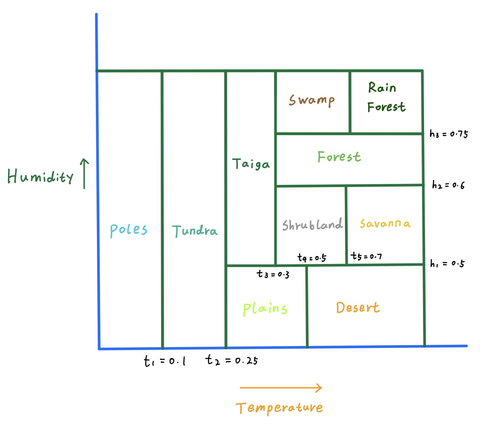

# Spherical World and Biome Generation

#### Hello, this is an attempt at making a prcedurally generated sphreical world. The code in this project are not meant to be refactored and concise, as i no longer work on this branch. So please be aware of the unconventional practices and spaghetti-ness in this project. You have been warned! I am now working on a better version of this project and could potentionally develop it into an procedurally generated sandbox/survival-ish game.

Here is a screenshot of what a fully generated world look like.

---

I will briefly go over the procedures for generating a world like this

Regarding the mesh, what the program does is it generate a cube with six planes, each plane has a resolution, and each plane can be subdivided. If we normalize all the vectors on the cube, the verticies will form a sphere. To deal with a uneven distribution of the verticies on the sphere, a transformation is used.

---

In order to make a culling of the generated mesh, each plane is divided into smaller subplanes. I define each subplane as a chunk of the mesh. In a coroutine, the chunks nearest the camera is appended into a queue alone with a callback. 

Each chunk in the queue is then processed over multiple threads. Each thread samples the height values through a height texture (which is not very precise), triangulate the verticies through marching square algorithm with multiple passes (which is not very efficient), and return the verticies and triangles alone with the callback.

Since the callback is in Unity's main thread, it takes the data and construct a mesh, and renders it. There is a boolean called "generate all". If true, the program will generate all the chunks over many threads and ignore the culling process. If false, the program will only generate nearby chunks. 

**If you want to "generate all", please make sure you set the plane resolution to no higher than 512 so that your computer doesn't explode**.

---
---

Now i will briefly go over how to generate a similar biome

Note that all textures and noises below are the results of a compute shader in unity, in order to increse the proformance.

---

There are of course many different ways implement a procedurally generated biome system. I can generate a biome straight out of noise, or using rapid exploring random trees, or using control points. I created the biome through emergence. The idea is that we create a humidity map, and then a temperature map. Then we define the biome types according to those values.

  </>

---

To construct a humidity map and a temperature map, i first constructed following textures:

- continent map
- altitude map
- proximity map
- height map
- temperature map
- humidity map

The first thing is to determine which point is ocean and which point is ocean and which point is land. In order to do that, i wrote program that randomly generated a continent map texture. Here are the steps:

- remap the index of each texture into a altitude and a longitude, then conver the coordinate to vector on a sphere.

- use that vector as the position of the simplex noise sample. The simplex noise also uses fractal brownian motion.

- set a threashold for the noise values, the ones above the threashold is continent, and the ones below the threshold is ocean.

- repeat the above process one more time with a smaller noise scale, then layer the two noises together

Here is an example continent map.

---

Now generate a altitude map. The value at each point on the altitude map is generated by how far the pixel is to the top and bottom of the texture. So the center of the texture has values close to 1, and the top/has the values close to 0.

Then some turbulence alone the y axis is applied to the texture, in order to add randomness to the altitude map. This is useful so that every altitude map is different.

Here is the output

---

Next up the the proximity map. I define a proximity map as to how close a point is to the ocean. I did not write an algorithm exactly for that becase that will be really slow. What i did is to just retain the noise values when generating the continent map, remap the values to a ranges like 0.6 to 1, and multiply the noises with the continent map. Naturally, the point with higher values was farther from the ocean. 

Here is the output

---

Next up is a fairly simple one. I defined the height map to just represent the elevations of each point. Here is the output.

---

Now we finished construcing all the necessary input maps. Let's take a look at temperature map.

Here is the basic idea:

- foreach pixel, sample the corresponding pixel in the altitude map. Higher values (close to equator) means higher temperature, vice versa.

- foreach pixel, sample the corresponding pixel in the proximity map. Higher values (far from ocean) means the temperature skew to both ends (0.8 is like 0.9, and 0.3 is like 0.1)

- foreach pixel, sample the corresponding pixel in the height map. Higher values (high elevation) means lower temperature.

- adjust the specific weights for each samples and add them together, thus form a temperature map. 

Here is the output

---

And lastly the humidity map using similar methods above:

- higher altitude means lower humidity

- higher proximity means lower humidity

- higher elevation means lower humidity

Here is the output

---

Now we have a humidity map and a temperature map, we can specify biomes according to each biome's humidity and temperature threshold. In unity, i wrote custom function in shader graph that took all the biome threshold and colors as input, and output the biome color depending on the temperature and humidity values. This draws biomes represented by colors on the sphere.

To make the shader precise and consistent, i changed the encoding of the two textures to R16 instead of 8 bits. The temperature and humidity maps can be linearly interpolated in the shader, thus making the biome boundary more smooth instead of pixalated.

Here is an example of a biome that is supposed to be desert (orange) surrounded by other biomes (black)

The material uses a shader that takes temperature and humidity threshold values and color of each biome as input, and renders it on the sphere. These boundaries can be adjusted during runtime as shown in the gif.

  </>

---

Next up are the height values at each vertex
